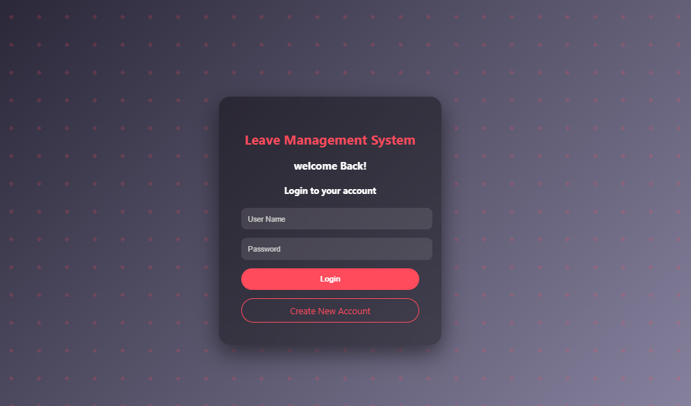
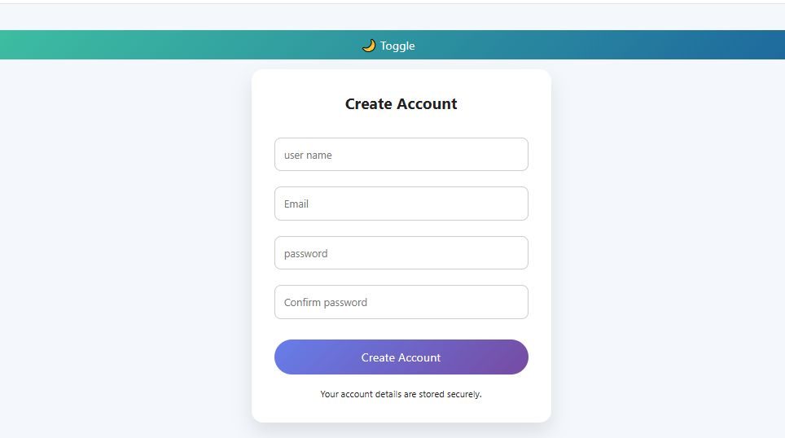
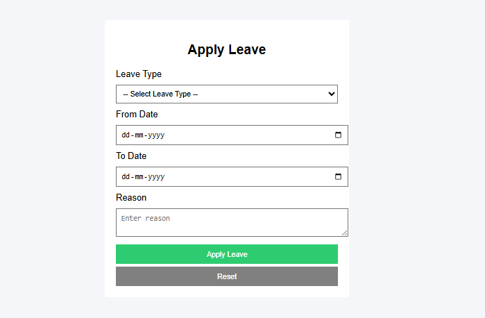
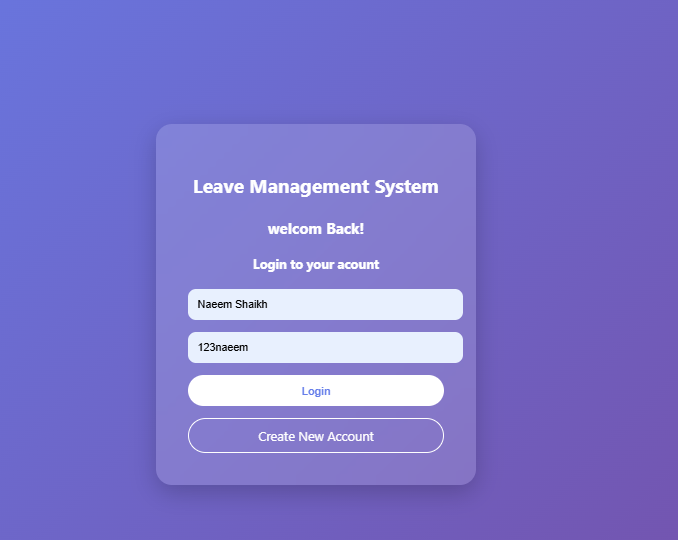
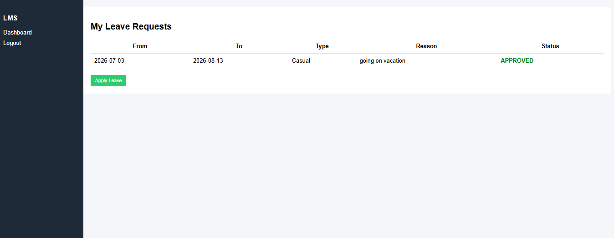
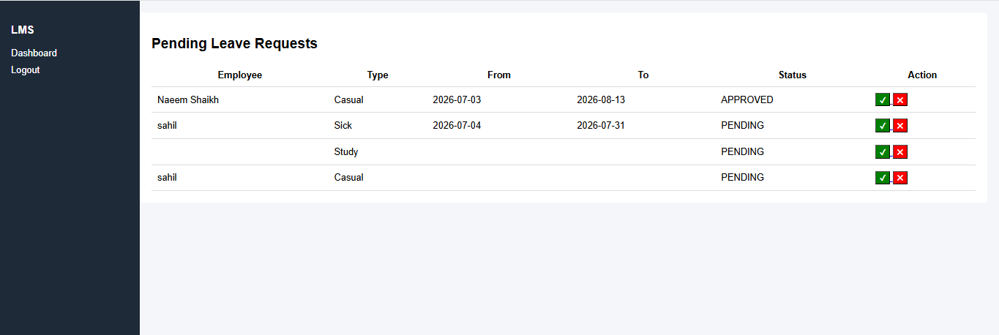

# 🚀 Leave Management System

A complete **Leave Management System** built using **Spring Boot + Thymeleaf + MySQL**.

---

## 📌 Features

- 👤 User Registration & Login  
- 🔐 Admin Panel Login  
- 📝 Apply Leave  
- 📊 Admin Dashboard (Approve / Reject Leave)  
- 🎨 Modern UI (Glassmorphism + Animations)

---

## 🛠 Tech Stack

- Java (Spring Boot)
- Spring Data JPA
- Thymeleaf
- MySQL
- HTML, CSS, JavaScript

---

## 📷 Screenshots

### 🔹 Admin Login


### 🔹 Admin Registration


### 🔹 Apply Leave


### 🔹 User Login


### 🔹 User Dashboard


### 🔹 Admin Dashboard


---

## ⚙️ Setup Instructions

1. Clone the repository
```bash
git clone https://github.com/YOUR_USERNAME/leave-management-system.git
